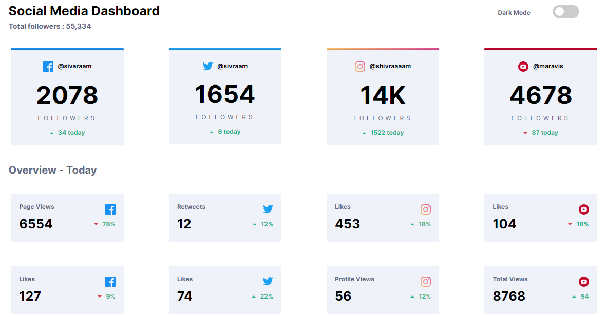
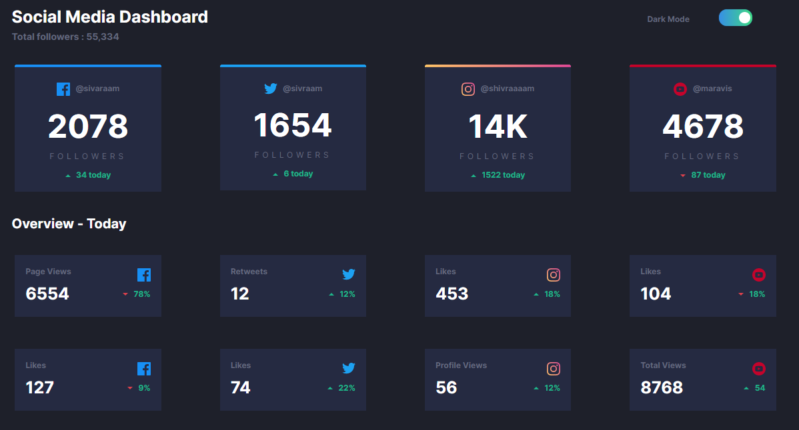
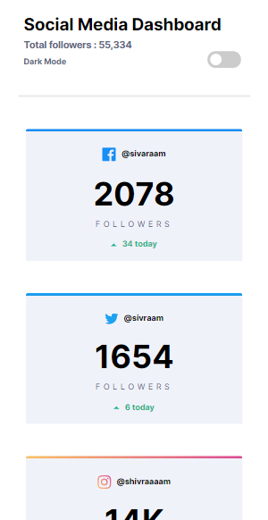
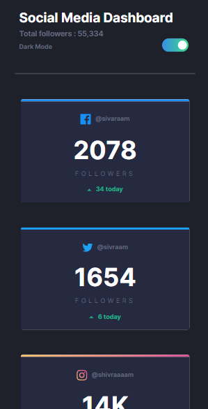

# Frontend Mentor - Huddle landing page with single introductory section solution

This is a solution to the [Social media dashboard with theme switcher challenge on Frontend Mentor](https://www.frontendmentor.io/challenges/social-media-dashboard-with-theme-switcher-6oY8ozp_H). 

## Table of contents

- [Overview](#overview)
  - [The challenge](#the-challenge)
  - [Screenshot](#screenshot)
  - [Links](#links)
  - [Built with](#built-with)

## Overview

### The challenge

Users should be able to:

- View the optimal layout for the site on laptop/mobile/tab
- Toggle color theme to their preference

### Screenshot

### Links

- Live URL: [Social Media Dashboard](https://s1varam.github.io/fe-challenge-smdashboard/)

### Built with

- HTML5
- CSS
- Bootstrap 5
- JS

